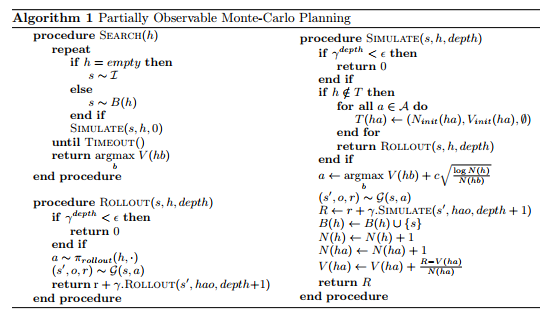

# POMCTS For Leduc Hold'em

This repository contains an implementation of the Monte Carlo Tree Search 
algorithm applied to the game of Leduc Hold'em.
The algorithm is based on [this](https://papers.nips.cc/paper/4031-monte-carlo-planning-in-large-pomdps.pdf) 
2010 paper by Silver and Veness.

The outline of the algorithm is shown below:

This algorithm is then extended to apply to extensive form games based on the procedure 
outlined by Heinrich [here](http://discovery.ucl.ac.uk/1549658/1/Heinrich_phd_FINAL.pdf) (chapter 3)